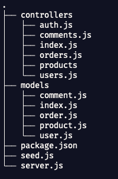
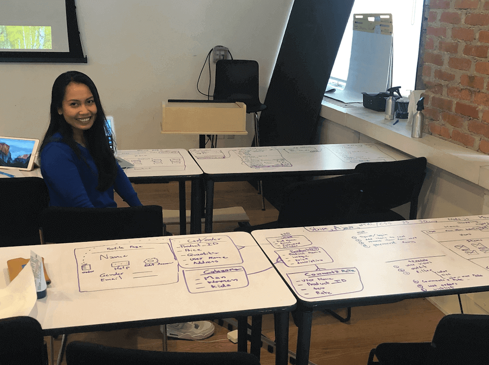

<!--  -->

# AP Shopping online

This app ....

* [Link to project hosted on Heroku](https://name.herokuapp.com/)
* [Link to project hosted on Github](https://github.com/kanjamad/e-commerce-API)

---

### Express file tree
With backend code to organize.

### Planning
I use 4 tables to write my project ideal, draw wireframs, write entity relationship diagram (ERD).

## Additional Resources
1. <a href="http://expressjs.com/starter/installing.html" target="_blank">Starting an Express Project</a>
2. <a href="http://expressjs.com/starter/hello-world.html" target="_blank">Express Hello World</a>
3. <a href="http://expressjs.com/starter/static-files.html" target="_blank">Express Static Files</a>
4. <a href="http://expressjs.com/4x/api.html#res.render" target="_blank">Express res.render()</a>
5. <a href="https://www.npmjs.com/package/helmet" target="_blank">helmet</a>
6. <a href="https://developer.mozilla.org/en-US/docs/Web/HTTP/Status" target="_blank">HTTP response status codes</a>
